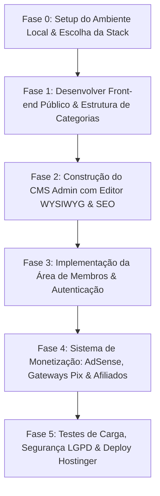

# Planejamento Estratégico de Implementação: Portal & Blog Concurseiro Focado

Este documento estabelece o **Planejamento Estratégico de Implementação** para o portal/blog de concursos públicos com CMS próprio, Área de Membros e Monetização Tripla, expandindo e estruturando os pontos abordados no [relatorio_viabilidade_blog_concursos.md](file:///c:/Users/Gabriel/APP/blog_concurseiro_focado/relatorio_viabilidade_blog_concursos.md).

> [!NOTE]
> **Objetivo Principal**: Garantir que o projeto passe por um período de teste e desenvolvimento estruturado no ambiente local/ambiente de testes antes da implantação final na **Hostinger**.

---

## 1. Escolha Tecnológica & Recomendação de Stack

Antes de iniciar a codificação das 4 grandes áreas (Estrutura, Design, Administração e SEO), é crucial alinhar a arquitetura tecnológica. Com base no relatório de viabilidade e nas opções da Hostinger (PHP/HTML, Node.js, etc.):

### 💡 Recomendação da Equipe de Engenharia (Caminho Ideal)

| Modelo de Arquitetura | Vantagens Principais | Complexidade de Manutenção | Recomendação |
| :--- | :--- | :--- | :--- |
| **Opção 1: PHP Moderno (Laravel / MVC)** | Rodagem nativa na Hostinger (PHP 8.x + MySQL); ORM nativo; autenticação pronta e segura para área de membros. | Baixa a Média | ⭐ **Altamente Recomendado** |
| **Opção 2: Next.js / Node.js + Supabase** | Front-end ultra-rápido, SEO imbatível com SSR/SSG, UI moderna e reativa. | Média | ⭐ **Excelente se optar pela aba Node.js na Hostinger** |
| **Opção 3: PHP Puro sem Framework** | Sem dependências externas. | Altíssima (exige recriar segurança, rotas e ORM do zero) | ❌ Não recomendado para sistemas complexos |

> [!TIP]
> **Recomendação Principal**: Adotar **Laravel (PHP 8.3) com Blade/Alpine.js ou Vue** se for usar a opção de site PHP da Hostinger, OU **Next.js + Tailwind/CSS customizado + Supabase** se for usar a opção Node.js. Ambas garantem alta velocidade, segurança contra injeção SQL/XSS e facilidade para criar o CMS e a Área de Membros.

---

## 2. Faseamento e Planejamento Estratégico por Pilar

---

### PILAR 1: Estrutura do Site & Arquitetura de Informação

Define a navegação, organização de conteúdos para os concurseiros e hierarquia de acesso (Gratuito vs. VIP).

#### Ações de Desenvolvimento:
1. **Taxonomia Multidimensional**:
   - Categorias por **Matéria** (Direito Constitucional, Administrativo, Raciocínio Lógico, etc.).
   - Categorias por **Banca Examinadora** (Cebraspe, FGV, FCC, Vunesp, etc.).
   - Categorias por **Carreira/Órgão** (Tribunais, Policial, Administrativa, Fiscal).
2. **Tipos de Conteúdo (Custom Post Types)**:
   - *Artigos de Estudo / Dicas* (Abertos/Públicos).
   - *Editais Verticalizados & Cronogramas* (Públicos com partes VIP).
   - *Cadernos de Questões & PDFs Resumo* (Exclusivos para Membros).
3. **Estrutura da Área de Membros**:
   - Nível 0: Visitante (Leitura pública).
   - Nível 1: Membro Gratuito (Acesso a comentários, favoritos e newsletters).
   - Nível 2: Membro VIP (Paywall completo, acesso a biblioteca de PDFs e simulados).

> [!IMPORTANT]
> **Perguntas para Você Pesquisar & Refletir (Momento: Início da Etapa 1)**:
> 1. *Quais as 5 matérias e as 3 bancas que serão o foco inicial de publicação no lançamento?*
> 2. *Quais conteúdos serão 100% gratuitos para atrair tráfego no Google e quais serão restritos ao cadastro (iscas digitais/VIP)?*
> 3. *Você pretende disponibilizar simulados interativos no futuro ou apenas PDFs para download?*

---

### PILAR 2: Design, UI/UX e Identidade Visual

Garante que o site passe autoridade, seja confortável para longas horas de leitura e se destaque visualmente de blogs amadores.

#### Ações de Desenvolvimento:
1. **Design System & Tipografia de Leitura**:
   - Tipografia primária para leitura prolongada (ex: *Inter*, *Outfit* ou *Merriweather* para o corpo do texto).
   - Paleta de cores com foco em concentração: Tons de azul escuro/marinho (confiança e foco), cinzas neutros para fundo e acentos em verde/dourado para chamadas de ação (CTA).
   - **Modo Escuro (Dark Mode)** nativo para estudantes que estudam à noite.
2. **Componentes Customizados para Concursos**:
   - **Blocos de Alerta**: Destaque para Jurisprudência (STF/STJ), Mudanças Legislativas e "Cai em Prova".
   - **Tabelas Comparativas**: Prazos de edital, vagas e remunerações.
   - **Leitor de PDF Embutido**: Visualização limpa dentro do navegador sem necessidade de baixar o arquivo imediatamente.

> [!IMPORTANT]
> **Perguntas para Você Pesquisar & Refletir (Momento: Início da Etapa 2)**:
> 1. *Existe algum site de concursos ou blog cujo visual/leitura você admira e quer usar como referência estética?*
> 2. *O público-alvo acessará majoritariamente pelo celular (mobile) ou computador durante as horas de estudo?*
> 3. *Deseja que o layout do artigo tenha barra lateral (sidebar) com anúncios ou prefere leitura em coluna única sem distrações?*

---

### PILAR 3: Administração & CMS Próprio

Garante que a gestão de conteúdo seja tão fácil e rica quanto o WordPress, sem o "peso" nem a vulnerabilidade de plugins de terceiros.

#### Ações de Desenvolvimento:
1. **Editor de Conteúdo Rico (WYSIWYG)**:
   - Integração do **TipTap** ou **CKEditor 5**.
   - Suporte a formatação rica, inserção de tabelas, vídeos, equações (LaTeX para raciocínio lógico) e blocos de código/citações jurídicas.
2. **Gerenciador de Mídia Inteligente**:
   - Upload de imagens via Drag-and-Drop.
   - Conversão e compressão automática para o formato **WebP** no servidor (otimização de carregamento).
3. **Controle de Permissões (RBAC)**:
   - *Super Admin*: Acesso total, incluindo finanças e membros.
   - *Redator/Professor*: Pode criar e publicar artigos sem alterar configurações do sistema.
   - *Revisor*: Pode editar rascunhos antes de irem ao ar.
4. **Agendamento & Workflow**:
   - Publicação agendada por data/hora.

> [!IMPORTANT]
> **Perguntas para Você Pesquisar & Refletir (Momento: Início da Etapa 3)**:
> 1. *Você escreverá os conteúdos sozinho ou haverá uma equipe/redatores convidados produzindo artigos?*
> 2. *Qual a frequência estimada de publicação semanal (ex: 3 posts/semana, 1 post/dia)?*
> 3. *Quais dados do painel admin são vitais para você ver no dashboard diário (ex: total de leitores, downloads de PDF, novos cadastros)?*

---

### PILAR 4: SEO Tecnológico & Estratégia de Conteúdo

Garante que o portal ranqueie no topo do Google para palavras-chave altamente buscadas por concurseiros (ex: "edital publicado X", "resumo de direito constitucional pdf").

#### Ações de Desenvolvimento:
1. **SEO On-Page Automação**:
   - Preenchimento de `Meta Title`, `Meta Description` e `Slug` com contador de caracteres em tempo real no CMS.
   - Marcadores Schema.org (JSON-LD) automáticos: `Article`, `FAQPage`, `BreadcrumbList`, `Course`.
   - Geração automática de `sitemap.xml` dinâmico e `robots.txt`.
2. **Performance & Core Web Vitals**:
   - Carregamento de páginas abaixo de 1.5 segundos.
   - Caching agressivo de assets estáticos e consultas de banco de dados.

> [!IMPORTANT]
> **Perguntas para Você Pesquisar & Refletir (Momento: Início da Etapa 4)**:
> 1. *Quais os termos de busca que o seu público digita quando procura pelo seu tipo de conteúdo no Google?*
> 2. *Você tem interesse em criar páginas de 'Cobertura de Editais em Tempo Real' para aproveitar picos de buscas no Google Discover?*

---

### PILAR 5: Área de Membros, Monetização & Vendas

Cria as fontes de receita (AdSense, Vendas Diretas e Afiliados) e a gestão de alunos.

#### Ações de Desenvolvimento:
1. **Google AdSense Integrado**:
   - Inserção flexível de slots de anúncios gerenciáveis pelo CMS (Topo, In-Article entre parágrafos, Sidebar e Rodapé).
   - Ocultação automática de anúncios AdSense para membros do nível VIP (valor agregado à assinatura).
2. **Gateway de Pagamento Transparente**:
   - Integração com **Mercado Pago API** ou **Asaas** para recebimento via Pix automático e Cartão de Crédito sem redirecionar o aluno para fora do site.
3. **Gerenciador de Links de Afiliados**:
   - Cloaking de links (ex: `concurseirofocado.com.br/go/curso-estrategia`) para rastreamento de cliques e conversões.

> [!IMPORTANT]
> **Perguntas para Você Pesquisar & Refletir (Momento: Início da Etapa 5)**:
> 1. *Qual será o modelo de venda dos materiais VIP: assinatura recorrente (ex: mensal/anual) ou venda avulsa por e-book/material?*
> 2. *Qual gateway de pagamento você já possui conta ou prefere utilizar (Mercado Pago, Asaas, Stripe, Kiwify)?*
> 3. *Quais programas de afiliados de cursos preparatórios você planeja integrar no início?*

---

## 3. Roteiro Sugerido de Execução Passo a Passo

---

## 4. Plano de Verificação e Testes

### Testes Automatizados & Locais (Antes do Deploy):
- **Validação de Código e Sintaxe**: Teste de rotas, conexão com banco de dados e APIs de pagamento em ambiente local.
- **Auditoria Lighthouse (Google)**: Garantir nota > 90 em Performance, Acessibilidade, Melhores Práticas e SEO.
- **Testes de Segurança**: Sanitização de formulários (CSRF, XSS) e teste de SQL Injection.

### Validação Manual:
- **Fluxo do Aluno**: Registro -> Confirmação de E-mail -> Pagamento de Teste Pix -> Liberação de PDF VIP.
- **Fluxo do Redator**: Login no CMS -> Criação de Post com tabelas/imagens -> Agendamento -> Publicação no Blog.
- **Deploy Hostinger**: Upload do projeto na Hostinger, configuração do SSL, banco de dados MySQL e teste final em domínio temporário/definitivo.

---

## 5. Próximos Passos Imediatos

1. **Aprovação do Plano**: Revise esta estrutura estratégica.
2. **Definição da Stack Tecnológica**: Escolha entre **PHP (Laravel)** ou **Node.js (Next.js)** para alinharmos os testes no ambiente local.
3. **Respostas da Fase 1**: Responda às perguntas de reflexão do Pilar 1 quando estiver pronto para iniciarmos a estruturação do código.
