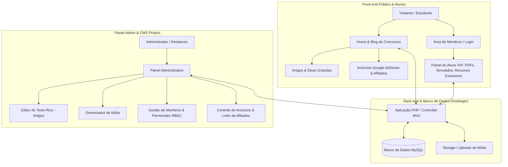
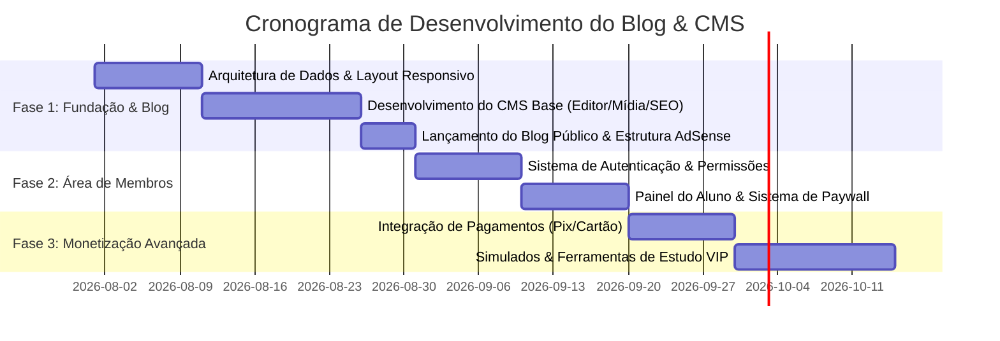

# Relatório de Viabilidade Técnica e Estratégica: Blog de Concursos Públicos com CMS Próprio e Área de Membros

---

## 1. Resumo Executivo

O objetivo do projeto é a criação de um **portal/blog focado em preparação para concursos públicos, técnicas de aprendizagem e materiais de estudo**, com infraestrutura hospedada na **Hostinger (opção "Site PHP/HTML personalizado")**. 

O projeto prevê:
1. **Interface Pública e Blog**: Conteúdo educacional de alto valor, otimizado para SEO e monetização.
2. **Área de Membros**: Cadastro/login com acesso a conteúdos VIP, PDFs exclusivos e ferramentas de estudo.
3. **Monetização Tripla**: Google AdSense, vendas de produtos próprios (e-books, cadernos de questões) e marketing de afiliados.
4. **Painel de Controle e CMS Próprio**: Sistema administrativo robusto com editor rico, controle de permissões (RBAC) e gestão de mídia — oferecendo uma experiência moderna sem a dependência do ecossistema WordPress.

> [!NOTE]
> **Veredito de Viabilidade**: **100% Viável**. A Hostinger oferece suporte completo ao ambiente PHP 8.x + MySQL/MariaDB necessário. Contudo, para construir um CMS "tão rico quanto o WordPress", a recomendação técnica é utilizar uma arquitetura baseada em um **Framework PHP Moderno (ex: Laravel)** ou **Arquitetura MVC Modular em PHP com bibliotecas modernas**, garantindo segurança, escalabilidade e produtividade.

---

## 2. Análise de Viabilidade: Hostinger & Stack Tecnológica

### 2.1 O que a Hostinger entrega na opção "Site PHP/HTML personalizado"?
A opção selecionada na Hostinger (conforme captura de tela do painel Hostinger) fornece um ambiente web tradicional completo (Apache/LiteSpeed), oferecendo:
* **Suporte a PHP 8.1 / 8.2 / 8.3** com extensões ativas (`PDO`, `GD`/`Imagick`, `mbstring`, `cURL`, `OpenSSL`, `zip`).
* **Banco de Dados MySQL / MariaDB** configurável com PHPMyAdmin e acesso via PDO/ORMs.
* **Certificado SSL Grátis (HTTPS)** essencial para AdSense, SEO e área de membros segura.
* **Gerenciador de Arquivos, Acesso SSH e Git Integrado** (para deploy contínuo).
* **Tarefas Cron (Cron Jobs)** para rotinas automáticas (envio de e-mails, renovação de membros, geração de sitemaps).

---

## 3. Comparativo Estratégico: CMS Próprio vs. WordPress vs. Laravel

Para entender a viabilidade de construir um CMS próprio igual ou superior ao WordPress para as suas necessidades, analisamos três caminhos:

| Critério | Opção A: CMS PHP Puro (Sem Framework) | Opção B: CMS Próprio com Laravel + Filament/Blade (Recomendado) | Opção C: WordPress Tradicional |
| :--- | :--- | :--- | :--- |
| **Customização total** | Total | Total e com código limpo | Limitada a plugins/temas |
| **Performance e Velocidade** | Extremamente alta | Muito alta | Média (exige muita otimização) |
| **Riqueza do Editor CMS** | Baixa a Média (exige integrar TinyMCE/CKEditor manualmente) | Altíssima (Editores WYSIWYG reativos modernos) | Altíssima (Gutenberg / Elementor) |
| **Área de Membros e Paywall** | Exige codificação do zero | Módulos nativos e seguros de Auth/Gate | Plugins terceiros (MemberPress) |
| **Custo de Manutenção** | Alto (manutenção contínua de código) | Baixo/Médio (código estruturado) | Baixo (atualização via painel) |
| **Segurança** | Depende 100% da disciplina do dev | Proteções nativas contra SQLi, XSS e CSRF | Vulnerável se usar plugins desatualizados |

> [!TIP]
> **Recomendação**: Para obter um CMS tão rico quanto o WordPress sem carregar o "peso" ou as vulnerabilidades do WordPress, a melhor abordagem é desenvolver um **CMS PHP personalizado utilizando Laravel ou uma arquitetura MVC PHP estruturada**, implantando editores WYSIWYG modernos (como **TipTap** ou **CKEditor 5**) no painel administrativo.

---

## 4. Arquitetura do Sistema Proposto

---

## 5. Recursos Detalhados do CMS e da Plataforma

### 5.1 O Painel de Administração (CMS Próprio)
Para ser equivalente em riqueza ao WordPress, o CMS administrativo conterá:

* **Editor Visual Avançado (WYSIWYG)**: Integração do **CKEditor 5**, **TinyMCE** ou **TipTap**, permitindo formatar texto, inserir tabelas comparativas de editais, blocos de destaque (alertas), citações de legislação, fórmulas (MathJax/LaTeX para raciocínio lógico) e incorporar vídeos do YouTube.
* **Gerenciador de Mídia**: Upload via Drag-and-Drop, organização por pastas, otimização automática de imagens para o formato `.webp` e redimensionamento automático.
* **Gestão de Roles & Permissões (RBAC)**:
  * **Super Admin**: Acesso total a configurações, faturamento e usuários.
  * **Editor/Redator**: Criação e publicação de artigos de estudo sem acesso às configurações do sistema.
  * **Autor Convidado**: Criação de rascunhos pendentes de aprovação.
* **Módulo de SEO Integrado**:
  * Edição de `Meta Title`, `Meta Description` e `Focus Keyword`.
  * Geração automática de URL amigável (`slug`).
  * Geração automática de arquivo `sitemap.xml` e `robots.txt`.
  * Marcação Schema.org em JSON-LD (`Article`, `FAQPage`, `Course`).
* **Agendamento de Publicações**: Programar posts para datas e horários específicos.

### 5.2 Recursos do Blog para Concurseiros
* **Categorização Dupla Inteligente**:
  * **Por Matéria**: Direito Constitucional, Administrativo, Português, Raciocínio Lógico, Informática, etc.
  * **Por Banca / Concurso**: Cebraspe, FGV, FCC, Vunesp, CNU, PF, PRF, Tribunais, etc.
* **Tabela de Edital Verticalizado & Cronogramas**: Ferramentas interativas para os alunos acompanharem o estudo.
* **Download de Materiais**: Resumos em PDF, mapas mentais e cadernos de questões.

### 5.3 Área de Membros (Recursos Exclusivos)
* **Autenticação Segura**: Registro, login, verificação de e-mail e recuperação de senha.
* **Níveis de Acesso (Gratuito vs. VIP/Pago)**:
  * **Membro Gratuito**: Acesso aos artigos públicos, comentários e recebimento de newsletter.
  * **Membro VIP**: Acesso a artigos bloqueados (paywall), biblioteca completa de PDFs, simulados exclusivos e cadernos de questões resolvidas.
* **Painel do Aluno**: Histórico de materiais baixados, artigos salvos nos "Favoritos" e progresso de leitura.

---

## 6. Monetização e Integrações Tecnológicas

### 6.1 Google AdSense
* **Viabilidade**: Totalmente compatível com sites PHP customizados.
* **Implementação**:
  * Inserção da tag global do AdSense no cabeçalho `<head>`.
  * Criação de **Slots de Anúncios Customizados** geridos pelo CMS (ex: topo do artigo, meio do texto, barra lateral e rodapé).
  * Inserção automática de anúncios entre parágrafos (via lógica PHP que injeta a tag após o N-ésimo parágrafo).
* **Requisitos do AdSense**: O site deve ter páginas institucionais obrigatórias (Política de Privacidade, Termos de Uso, Sobre Nós, Contato), navegação clara e conteúdo original de alta qualidade.

### 6.2 Venda de Produtos Próprios e Checkout Direct
* **Infraestrutura**: Integração via API de gateways de pagamento transparentes (ex: **Mercado Pago API**, **Asaas** ou **Stripe**).
* **Fluxo de Venda**:
  1. O usuário seleciona um e-book/material no blog.
  2. Realiza o pagamento via Pix ou Cartão diretamente no site.
  3. O webhook do gateway confirma o pagamento e o sistema PHP libera o acesso instantâneo no Painel do Membro.
* **Plataformas Alternativas**: Integração de widgets ou links para plataformas externas (Kiwify, Hotmart, Eduzz) se desejar delegar a gestão fiscal/afiliados.

### 6.3 Marketing de Afiliados
* **Inclusão no CMS**: Gerenciador de links de afiliados com cloaking/redirecionamento (ex: `seusite.com/go/curso-estrategia`).
* **Banners Dinâmicos**: Inserção de banners promocionais de grandes cursos preparatórios com rastreamento de cliques.

---

## 7. Requisitos de Segurança e LGPD

Tratando-se de um sistema com cadastro de membros e transações financeiras, os seguintes pilares de segurança devem ser codificados:

1. **Proteção contra Injeção de SQL**: Uso exclusivo de `Prepared Statements` via PDO no PHP.
2. **Proteção contra XSS (Cross-Site Scripting)**: Sanitização rigorosa de inputs HTML e uso de funções como `htmlspecialchars()`.
3. **Criptografia de Senhas**: Algoritmos modernos como `Bcrypt` ou `Argon2id` (`password_hash()`).
4. **Proteção CSRF**: Tokens anti-CSRF em todos os formulários e formulários de login/registro.
5. **Conformidade com a LGPD**: Opção para exportação e exclusão de dados do usuário, aceite explícito de termos e política de cookies.

---

## 8. Roteiro Sugerido de Desenvolvimento (Roadmap)

---

## 9. Conclusão e Próximos Passos

Criar este portal em **PHP/HTML personalizado na Hostinger** sem WordPress é uma escolha **estratégica e perfeitamente viável**. Ela garante um site extremamente rápido, sem problemas com atualizações de plugins que quebram o layout, e totalmente customizado para as necessidades dos estudantes de concursos públicos.

### Recomendação Final
Para viabilizar este projeto mantendo a qualidade de um CMS avançado:
1. **Estrutura de Código**: Adotar o padrão **MVC (Model-View-Controller)** em PHP para separar visual, regras de negócio e banco de dados.
2. **Editor de Conteúdo**: Incorporar o **CKEditor 5 Premium** ou **TipTap** no painel admin para garantir formatação rica e fácil de usar.
3. **Fases de Implementação**: Iniciar com a **Fase 1 (Blog + CMS Admin)** para acumular tráfego e aprovação no AdSense, liberando a **Área de Membros VIP** sequencialmente.
